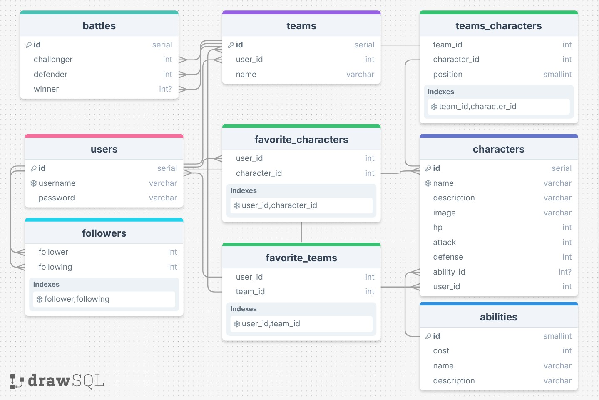

# Battle of the Brands (API)

## Overview

Battle of the Brands is a character creator, collector, and battler. Users can create characters then assemble teams to fight.

## Features

### Characters

Users can customize their characters with HP, Attack, and Defense stats. Every character also gets a special ability to give it a boost in combat.

### Teams

Teams are comprised of five characters. Users can assemble teams full of their own characters or anyone else's. Within the team, each character has a position that determines the order they'll fight.

### Social

Users can favorite characters and teams to save for later. They can also follow their friends and adversaries.

### Battles

Teams can challenge each other to fight in turn based combat.

## Tech Stack

- Express.js for the api app
- PostgreSQL for the database

## Architecture

### Folder Structure

```text
.
├── api/
├── db/
│   └── queries/
├── middleware/
├── utils/
└── app.js
```

### System Design

The express app has abilities, characters, teams, and users routes. It allows for the creation of characters, teams, and users. The abilities table is only used to store information.

### Database Schema


